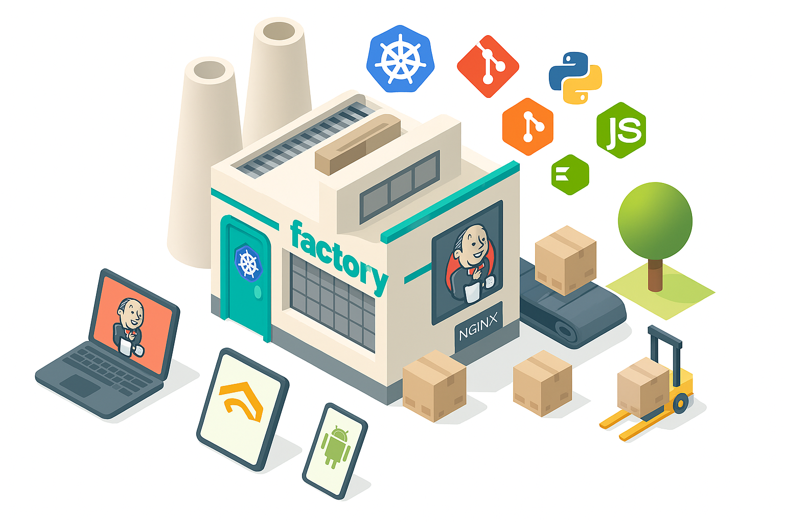
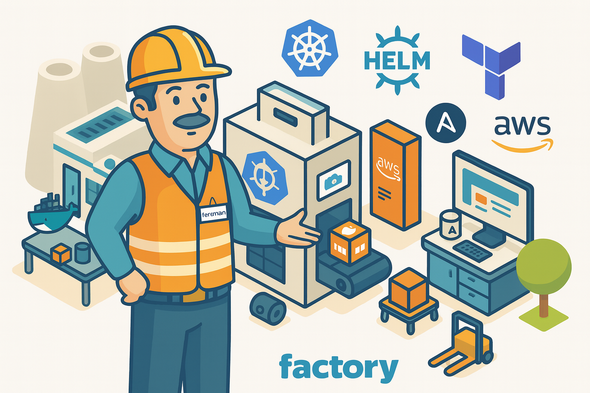

# Factory VM - ARM64 CI/CD Build Environment

**Production-ready ARM64 virtual machine with Jenkins, Docker, Kubernetes, and complete DevOps toolchain.**



## 🚀 Quick Start

### Prerequisites

The installer needs QEMU and skopeo:

**Ubuntu/Debian**:
```bash
sudo apt-get update
sudo apt-get install -y qemu-system-arm qemu-efi-aarch64 qemu-utils skopeo
```

**RHEL/Rocky/AlmaLinux**:
```bash
sudo dnf install -y qemu-system-aarch64 qemu-efi-aarch64 qemu-img skopeo
```

**Arch Linux**:
```bash
sudo pacman -S qemu-system-aarch64 edk2-armvirt skopeo
```

**Note**: `skopeo` is used to download and cache the Jenkins Docker image on the host without requiring Docker. If skopeo is not available, Jenkins will still work but the image will be downloaded inside the VM (slower, ~10 minutes on first install).

### One-Liner Installation

Install with a single command:

```bash
curl -fsSL https://raw.githubusercontent.com/jcgarcia/factory-vm/main/install.sh | bash
```

This will:
- Clone the repository (or update if already exists)
- Run the automated installation

Or manually:

```bash
git clone https://github.com/jcgarcia/factory-vm.git
cd factory-vm
./setup-factory-vm.sh --auto
```

Installation takes ~15-20 minutes and sets up everything automatically:
- ✅ Alpine Linux ARM64
- ✅ Jenkins with Java 21 (secure random password)
- ✅ Docker, Kubernetes, Terraform, AWS CLI
- ✅ SSL/HTTPS (no warnings after setup)
- ✅ Jenkins CLI on host (jenkins-factory command)
- ✅ Foreman user for automation
- ✅ All tools auto-configured

### Access Jenkins

After installation completes, check `~/.factory-vm/credentials.txt` for your auto-generated password.

**Web UI**:
```bash
# Open in browser (will be HTTPS with no warnings)
https://factory.local

# Login credentials are in:
cat ~/.factory-vm/credentials.txt
```

**CLI** (from host machine):
```bash
# Reload your shell
source ~/.bashrc

# Test connection
jenkins-factory who-am-i

# List jobs
jenkins-factory list-jobs

# Trigger a build
jenkins-factory build my-job
```

**SSH**:
```bash
ssh factory
```

## 📋 What's Included

### Jenkins CI/CD
- **Version**: Latest LTS with Java 21 (support until 2029)
- **Architecture**: Agent-based (built-in node disabled)
- **Agent**: factory-agent-1 (2 executors, ARM64, Docker, K8s)
- **Plugins**: 25+ essential plugins pre-installed
- **SSL**: HTTPS with trusted certificates
- **User**: `foreman` (admin role, auto-generated password saved to `~/.factory-vm/credentials.txt`)

### Container & Orchestration
- Docker (latest stable)
- Kubernetes (kubectl - latest stable)
- Helm (latest stable)

### Infrastructure as Code
- Terraform (latest stable)
- Jenkins Configuration as Code (JCasC)

### Cloud Tools
- AWS CLI v2 (latest)
- jcscripts (awslogin)

> **Note**: All tool versions are automatically detected and installed during setup. The installer always fetches the latest stable versions available at installation time.

### Development Tools

- Git, Node.js, Python, OpenJDK
- Build tools: gcc, g++, make, cmake

## 📖 Documentation

Comprehensive guides are available:

- **[JENKINS-CONFIGURATION.md](./docs/JENKINS-CONFIGURATION.md)** - Complete Jenkins setup guide
  - Architecture overview
  - Plugin details
  - Best practices
  - Troubleshooting
  
- **[JENKINS-CLI.md](./docs/JENKINS-CLI.md)** - Jenkins CLI usage guide
  - Command reference
  - Examples and patterns
  - Automation recipes
  - Security best practices
  
- **[CHANGELOG.md](./docs/CHANGELOG.md)** - Version history and changes

- **[JENKINS-CLI-IMPLEMENTATION.md](./docs/JENKINS-CLI-IMPLEMENTATION.md)** - Technical implementation details

## 🔧 VM Management

### Convenience Commands

Simplest way to manage the VM:

```bash
factorystart    # Start the VM
factorystop     # Stop the VM
factorystatus   # Check VM status
```

### Direct Scripts

Alternatively, use the scripts directly:

```bash
~/vms/factory/start-factory.sh
~/vms/factory/stop-factory.sh
~/vms/factory/status-factory.sh
```

### SSH Access

```bash
# Simple alias
ssh factory

# Or full command
ssh -p 2222 foreman@localhost
```

## 💻 Using Jenkins CLI

The `jenkins-factory` command provides full Jenkins CLI access from your host machine.

### Quick Examples

```bash
# Verify you're connected
jenkins-factory who-am-i

# Get Jenkins version
jenkins-factory version

# List all jobs
jenkins-factory list-jobs

# Create a job from XML
jenkins-factory create-job my-app < job-config.xml

# Trigger a build
jenkins-factory build my-app

# Trigger with parameters
jenkins-factory build my-app -p ENV=production -p VERSION=1.0.0

# Watch console output
jenkins-factory console my-app -f

# List installed plugins
jenkins-factory list-plugins

# Install a plugin
jenkins-factory install-plugin docker-workflow

# Restart Jenkins safely
jenkins-factory safe-restart

# Execute Groovy script
jenkins-factory groovy = < my-script.groovy
```

### Advanced Usage

See [JENKINS-CLI.md](./docs/JENKINS-CLI.md) for:
- Complete command reference
- Pipeline job creation
- Credential management
- Node/agent administration
- Automation patterns
- CI/CD integration examples

## 🏗️ Architecture

### VM Configuration
- **OS**: Alpine Linux 3.19 ARM64
- **Hostname**: factory.local
- **User**: foreman (with sudo)
- **RAM**: 8GB
- **CPUs**: 6 cores
- **System Disk**: 50GB
- **Data Disk**: 200GB
- **SSH Port**: 2222 → 22
- **HTTPS Port**: 443 → 443

### Jenkins Architecture
- **Controller**: Jenkins LTS with Java 21
- **Built-in Node**: DISABLED (best practice)
- **Agents**: factory-agent-1 (2 executors)
  - Runs in Docker container
  - Docker-in-Docker enabled
  - Labels: arm64, docker, kubernetes

### Network
```
Host Machine                    Factory VM
-----------                     ----------
localhost:443 ─────────────────> Caddy :443
                                   │
                                   └──> Jenkins :8080

localhost:2222 ─────────────────> SSH :22
```

## 🔒 Security

### Users and Credentials

**Jenkins Web UI & CLI**:
- Username: `foreman`
- Password: Auto-generated during installation
- API Token: Auto-generated
- Token Location: `~/.jenkins-factory-token`
- Credentials saved to: `~/.factory-vm/credentials.txt`

**VM SSH**:
- Username: `foreman`
- Authentication: SSH key (`~/.ssh/factory-foreman`)

### SSL/HTTPS
- Caddy Local CA (trusted certificate)
- Valid until 2035
- No browser warnings after initial setup
- Certificate auto-installed in:
  - System trust store
  - Chrome/Chromium/Brave
  - Firefox (all profiles)

## 🚦 Troubleshooting

### Jenkins Not Accessible

```bash
# Check if VM is running
ssh factory 'docker ps | grep jenkins'

# Check Jenkins logs
ssh factory 'docker logs jenkins | tail -50'

# Restart Jenkins
ssh factory 'sudo rc-service jenkins restart'
```

### Jenkins CLI Issues

```bash
# Refresh API token
rm ~/.jenkins-factory-token
~/vms/factory/setup-jenkins-cli.sh

# Test connection
jenkins-factory who-am-i

# Check if Jenkins is ready
curl -I https://factory.local/
```

### Certificate Warnings

```bash
# Re-install certificates (close browsers first)
# Certificates are installed automatically during setup
# If you still see warnings, restart your browser

# Manual certificate installation if needed
# The certificate is automatically copied from the VM
```

### VM Won't Start

```bash
# Check if already running
ps aux | grep qemu | grep factory

# Check for port conflicts
sudo lsof -i :443
sudo lsof -i :2222

# Kill existing instance
pkill -9 -f qemu-system-aarch64

# Start fresh
~/vms/factory/start-factory.sh
```

### Agent Not Connecting

```bash
# Check agent status in Jenkins UI
# Navigate to: Manage Jenkins → Manage Nodes → factory-agent-1

# Restart Jenkins to reconnect agent
ssh factory 'sudo rc-service jenkins restart'

# Check Docker is running
ssh factory 'docker ps'
```

## 📊 Performance

### Build Times (Approximate)
- **Initial Installation**: 15-20 minutes
- **VM Boot**: 30-60 seconds
- **Jenkins Start**: 2-3 minutes
- **Docker Build** (simple): 1-5 minutes

### Resource Usage
- **Disk**: ~15GB after installation
- **RAM**: ~2-4GB during normal operation
- **CPU**: Varies with build activity

## 🔄 Common Workflows

### Create a Pipeline Job

```bash
# Create pipeline XML
cat > my-pipeline.xml << 'EOF'
<?xml version='1.1' encoding='UTF-8'?>
<flow-definition plugin="workflow-job">
  <description>ARM64 Build Pipeline</description>
  <definition class="org.jenkinsci.plugins.workflow.cps.CpsFlowDefinition">
    <script>
pipeline {
    agent { label 'arm64' }
    stages {
        stage('Build') {
            steps {
                sh 'docker build -t myapp:arm64 .'
            }
        }
        stage('Test') {
            steps {
                sh 'docker run myapp:arm64 npm test'
            }
        }
        stage('Push') {
            steps {
                sh 'docker push myapp:arm64'
            }
        }
    }
}
    </script>
    <sandbox>true</sandbox>
  </definition>
</flow-definition>
EOF

# Create the job
jenkins-factory create-job my-arm64-pipeline < my-pipeline.xml

# Trigger build
jenkins-factory build my-arm64-pipeline -s -v
```

### Build Docker Image on Factory

```bash
# Copy project to Factory
scp -r ./myapp factory:/home/foreman/

# SSH and build
ssh factory
cd myapp
docker build -t myapp:arm64 .
docker images

# Or build remotely
ssh factory 'cd myapp && docker build -t myapp:arm64 .'
```

### Deploy to AWS ECR

```bash
# On host, login to AWS
awslogin

# SSH forwards credentials automatically
ssh factory

# Tag and push
docker tag myapp:arm64 123456789.dkr.ecr.us-east-1.amazonaws.com/myapp:arm64
docker push 123456789.dkr.ecr.us-east-1.amazonaws.com/myapp:arm64
```

## 🎯 Why ARM64?

Building ARM64 images provides significant benefits:

- **💰 Cost Savings**: 30-40% cheaper on AWS Graviton instances
- **⚡ Performance**: Better performance per dollar
- **🌱 Energy**: Lower power consumption
- **🔮 Future**: Industry trend toward ARM architecture

## 🆘 Support

### Log Locations

**Installation Log**:
```bash
ssh factory 'cat /root/factory-install.log'
```

**Jenkins Logs**:
```bash
ssh factory 'docker logs jenkins'
ssh factory 'docker logs -f jenkins'  # Follow
```

**VM Status**:
```bash
~/vms/factory/status-factory.sh
```

### Re-run Installation

If something fails during installation:

```bash
# Complete reinstall (destroys data)
pkill -9 -f qemu-system-aarch64
rm -rf ~/vms/factory
cd factory-vm
./setup-factory-vm.sh --auto
```

### Manual Component Installation

Optional components can be installed if needed:

```bash
# Android SDK
~/vms/factory/install-android-sdk.sh

# Ansible
~/vms/factory/install-ansible.sh
```

## 📝 Files and Directories

```
factory-vm/ (repository)
├── install.sh                     # One-liner entry point
├── setup-factory-vm.sh            # Main installation script
├── alpine-install.exp             # Alpine automated install
├── README.md                      # This file
├── CHANGELOG.md                   # Version history
├── QUICK-START.md                 # Quick reference guide
└── [documentation files]          # JENKINS-*, SECURITY-*, etc.

~/factory-vm/ (local installation)
├── setup-factory-vm.sh            # Downloaded installer
├── alpine-install.exp             # Downloaded expect script
└── cache/                         # Cached downloads (preserved)
    ├── alpine/                    # Alpine ISO
    ├── terraform/                 # Terraform binaries
    ├── kubectl/                   # kubectl binaries
    ├── helm/                      # Helm archives
    ├── awscli/                    # AWS CLI installer
    ├── ansible/                   # Ansible requirements
    └── jenkins/plugins/           # Jenkins plugins

~/vms/factory/ (VM directory)
├── factory.qcow2                  # System disk (50GB)
├── factory-data.qcow2             # Data disk (200GB)
├── factory.pid                    # VM process ID
├── start-factory.sh               # Start VM script
├── stop-factory.sh                # Stop VM script
├── status-factory.sh              # Status check script
├── setup-jenkins-cli.sh           # Jenkins CLI setup
├── install-android-sdk.sh         # Optional: Android SDK
├── install-ansible.sh             # Optional: Ansible
├── vm-setup.sh                    # VM configuration script
└── FACTORY-README.md              # VM documentation

~/.factory-vm/
└── credentials.txt                # Jenkins & VM passwords

~/.ssh/
└── factory-foreman                # SSH private key (ed25519)

~/.ssh/config.d/
└── factory                        # SSH alias configuration

~/.scripts/ (convenience commands)
├── factorystart -> ~/vms/factory/start-factory.sh
├── factorystop -> ~/vms/factory/stop-factory.sh
└── factorystatus -> ~/vms/factory/status-factory.sh

~/.jenkins-factory-token           # Jenkins CLI API token
~/jenkins-cli-factory.jar          # Jenkins CLI executable
```

## 🔮 Roadmap

Planned improvements:

- [ ] Multiple agent support
- [ ] Backup/restore automation
- [ ] Monitoring and alerting
- [ ] HA Jenkins configuration
- [ ] Additional cloud provider support
- [ ] Auto-scaling agents

## 📜 License

MIT License - See LICENSE file for details

## 🤝 Contributing

Contributions welcome! Please:
1. Fork the repository
2. Create a feature branch
3. Test thoroughly
4. Submit a pull request

## 📞 Contact

For issues or questions:
- Check documentation in this directory
- Review logs: `ssh factory 'docker logs jenkins'`
- Consult [JENKINS-CLI.md](./docs/JENKINS-CLI.md) for CLI issues
- See [JENKINS-CONFIGURATION.md](./docs/JENKINS-CONFIGURATION.md) for setup questions

---

**Factory VM** - Professional ARM64 CI/CD environment for modern DevOps workflows.

---

## 🏗️ Development & Architecture (For Contributors)

### Repository Structure

This is the **development repository** (Ingasti/FactoryVM) with full source code.

**Public distribution** is at: [jcgarcia/factory-vm](https://github.com/jcgarcia/factory-vm)

```text
FactoryVM/ (Development Repo)
├── tools/
│   ├── setup-factory-vm.sh      # Main orchestrator (445 lines, modular)
│   ├── alpine-install.exp       # Alpine automation
│   ├── publish                  # Publishing script (like jcscripts)
│   ├── clean-for-test.sh        # Clean environment for testing
│   └── lib/                     # Modular architecture (15 modules)
│       ├── *.sh                 # Individual module files (editable)
│       └── modules.ar           # Packaged archive (71KB, auto-generated)
├── activity/
│   ├── sprints/                 # Sprint documentation
│   │   └── PHASE-3.5-SPRINT.md  # Modular refactor complete history
│   └── planning/                # Planning documents
├── docs/                        # User documentation
├── PUBLISH-WORKFLOW.md          # How to publish changes
└── README.md                    # This file
```

### Modular Architecture (Phase 3.5)

**Code Reduction**: 5,155 lines → 445 lines orchestrator + 15 modules (91.6% reduction)

**15 Modules** (1,925 lines total):

- **Core**: `common.sh` (179), `cache-manager.sh` (402)
- **Lifecycle**: `vm-lifecycle.sh` (305), `vm-bootstrap.sh` (267)
- **Installers**: 9 modules (704 lines) - base, docker, caddy, k8s, terraform, aws, jcscripts, jenkins, configure-jenkins
- **Certificates**: `install-certificates.sh` (127)
- **UI**: `setup-motd.sh` (92)

### Making Changes

**See [PUBLISH-WORKFLOW.md](./PUBLISH-WORKFLOW.md) for complete guide**

```bash
# 1. Edit module
vim tools/lib/install-jenkins.sh

# 2. Rebuild archive
cd tools && rm -f lib/modules.ar && ar rcs lib/modules.ar lib/*.sh && cd ..

# 3. Test locally
bash tools/setup-factory-vm.sh --auto

# 4. Commit to dev repo
git add tools/lib/*.sh tools/lib/modules.ar
git commit -m "Fix: description"
git push

# 5. Publish to public repo
tools/publish -c   # Create distribution in dist/
tools/publish -p   # Push to jcgarcia/factory-vm
```

### Publishing Workflow

Uses **same method as jcscripts**:

- Development: Individual `.sh` files in `tools/lib/`
- Distribution: All modules packed into `modules.ar` archive (71KB)
- Installation: One-liner downloads and extracts archive

**Publishing commands**:


```bash
tools/publish -c   # Create dist/ directory with packaged modules
tools/publish -p   # Force-push to public GitHub repo
```

### Testing

```bash
# Clean environment
tools/clean-for-test.sh

# Run full installation
bash tools/setup-factory-vm.sh --auto

# Or use one-liner after publishing
curl -fsSL https://raw.githubusercontent.com/jcgarcia/factory-vm/main/install.sh | bash
```

### Documentation for Development

- **PUBLISH-WORKFLOW.md** - Quick reference for publishing changes
- **activity/sprints/PHASE-3.5-SPRINT.md** - Complete modular refactor history
- **activity/planning/** - Sprint plans and architecture docs

### Key Notes for AI/Copilot

⚠️ **Always read these before making changes**:

1. **Module changes require archive rebuild**:

   ```bash
   cd tools && ar rcs lib/modules.ar lib/*.sh
   ```

2. **dist/ is gitignored** - Never commit to dev repo, only pushed to public repo

3. **Force-push to public is intentional** - Replaces entire public repo (like jcscripts)

4. **Test before publishing** - Run local installation first

5. **Follow jcscripts model** - We use the same distribution pattern

---

Version 2.0.0 (Modular Architecture) - Last updated: 2025-11-24


